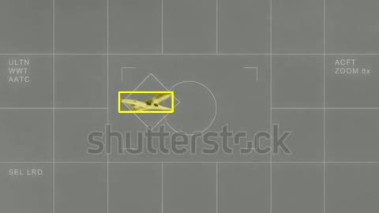
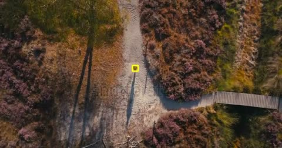
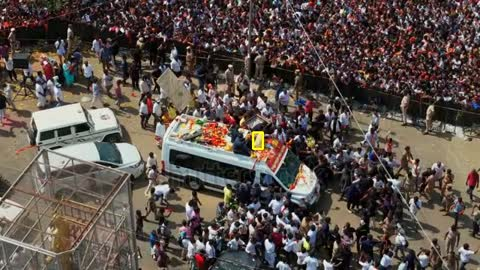

# 🎯 Target Locker

**Select one object. Keep tracking it.**

Single-object tracking (**SOT**) powered by SAM2.1 Tiny. Click an object in a video or webcam frame to track its mask and bounding box across subsequent frames—no separate object detector required.

## Demos

Click a preview to open the full video.

| Demo 1 | Demo 2 | Demo 3 |
| :---: | :---: | :---: |
|  |  |  |

## How it works

1. Open a video or webcam stream.
2. Click the object you want to follow.
3. Track that single target with a segmentation mask and bounding box.
4. Save the tracked video.

**Mac:** CPU or Apple GPU (MPS). **Colab:** GPU notebook with video upload and download.

Tracking speed depends on hardware. Occlusion and fast motion can cause the target to be lost. Output videos have no audio.

## Built with

[SAM2_streaming](https://github.com/khw11044/SAM2_streaming) · [Meta SAM 2](https://github.com/facebookresearch/sam2) · PyTorch · OpenCV

Based on SAM2_streaming, distributed under Apache 2.0.
