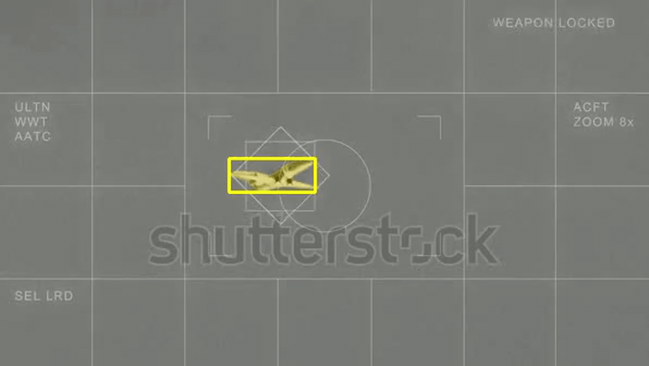
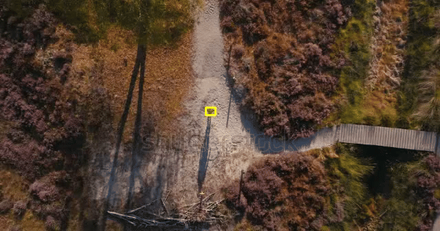
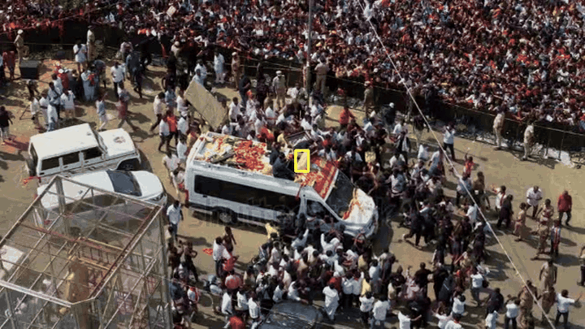

<div align="center">

# 🎯 Target Locker

### Lock one target. Track only that target.

**Persistent Single-Object Tracking (SOT) using SAM2.1 Tiny**


Select a single object in a video or webcam frame, then keep tracking **that same object only** with a segmentation mask and bounding box.

</div>

---

## 🎬 Demo Previews

> The GIF previews below are the main focus of this README so visitors can instantly see the tracker in action.

### Demo 01
<p align="center">
  
</p>

### Demo 02
<p align="center">
  
</p>

### Demo 03
<p align="center">
  
</p>

<details>
<summary><b>Full MP4 videos</b></summary>
<br>

- [Demo 01 video](demos/demo-01.mp4)
- [Demo 02 video](demos/demo-02.mp4)
- [Demo 03 video](demos/demo-03.mp4)

</details>

---

## ✨ Highlights

- 🎯 **Target Locking** — manually select one object
- 🧠 **SAM2.1 Tiny** — efficient mask-based tracking
- 🟩 **Mask + Bounding Box** — clear visualization of the tracked target
- 🎥 **Video or Webcam Input** — works on recorded or live input
- 💾 **Save Output** — export processed tracking videos
- ⚡ **No separate detector after initialization**

---

## ⚙️ How It Works

```text
Video / Webcam
      ↓
Click target once
      ↓
Initialize SAM2
      ↓
Propagate target mask across frames
      ↓
Track the same target only
      ↓
Display mask + box
      ↓
Save tracked result
```

---

## 🚀 Quick Workflow

1. Open a video or webcam stream.
2. Click the object you want to lock.
3. The tracker initializes that target.
4. It follows the same object over the next frames.
5. The output is shown with a segmentation mask and bounding box.
6. Save the tracked video.

---

## 💻 Runtime Notes

**macOS**: CPU or Apple GPU via **MPS**  
**Colab**: GPU notebook with video upload/download support

> Tracking speed depends on hardware, input resolution, and video length.

---

## ⚠️ Limitations

Tracking quality may drop during:

- heavy occlusion
- very fast motion
- large appearance changes
- target leaving the frame
- low-contrast or difficult scenes

Output videos currently contain **no audio**.

---

## 🧰 Built With

- [SAM2_streaming](https://github.com/khw11044/SAM2_streaming)
- [Meta SAM 2](https://github.com/facebookresearch/sam2)
- PyTorch
- OpenCV
- Python

---

## 🙏 Acknowledgement

This project is based on **SAM2_streaming** and Meta's **SAM 2**.
